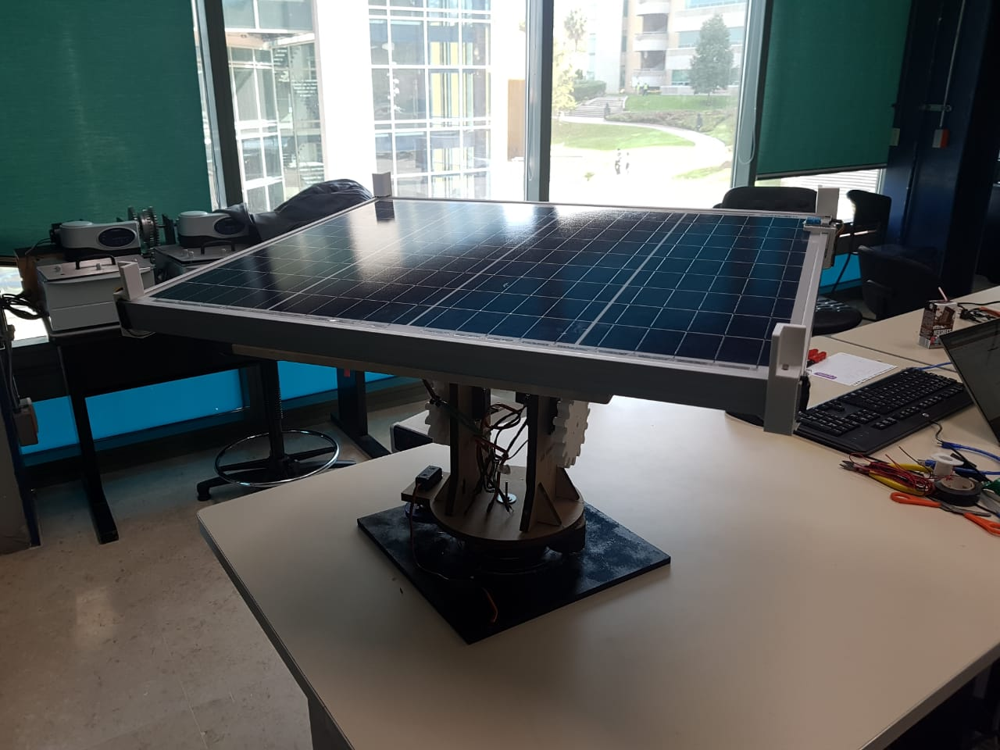
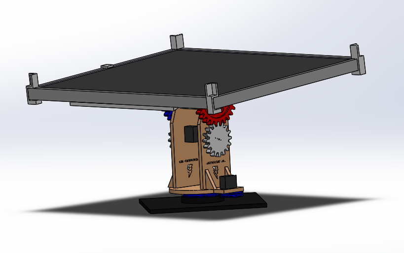
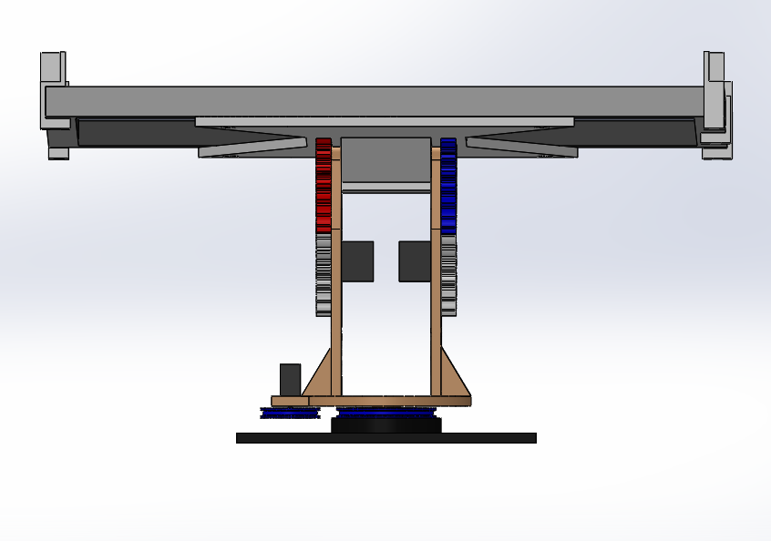
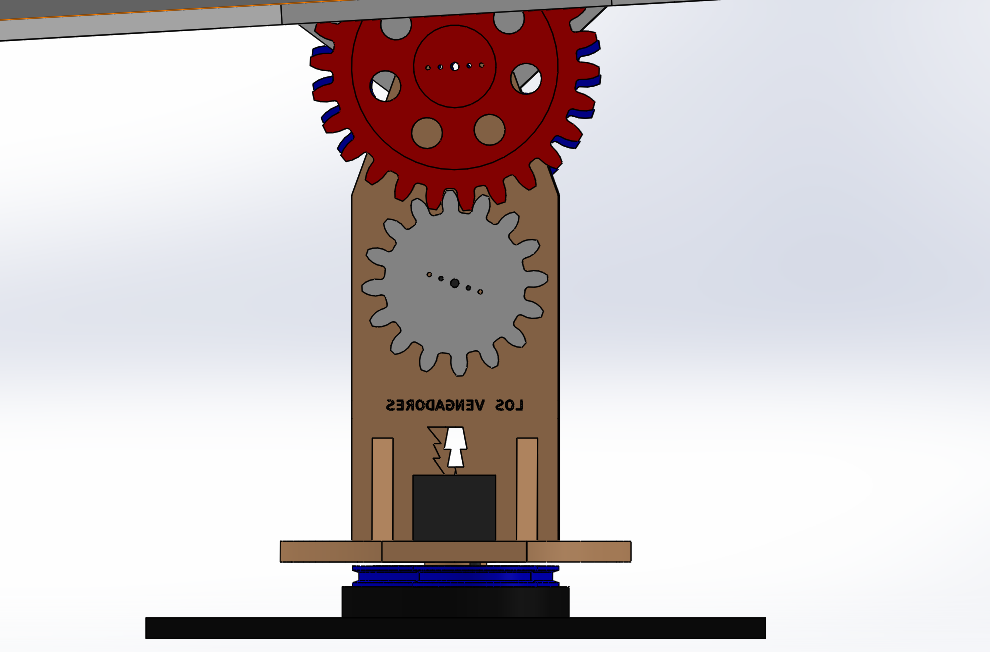
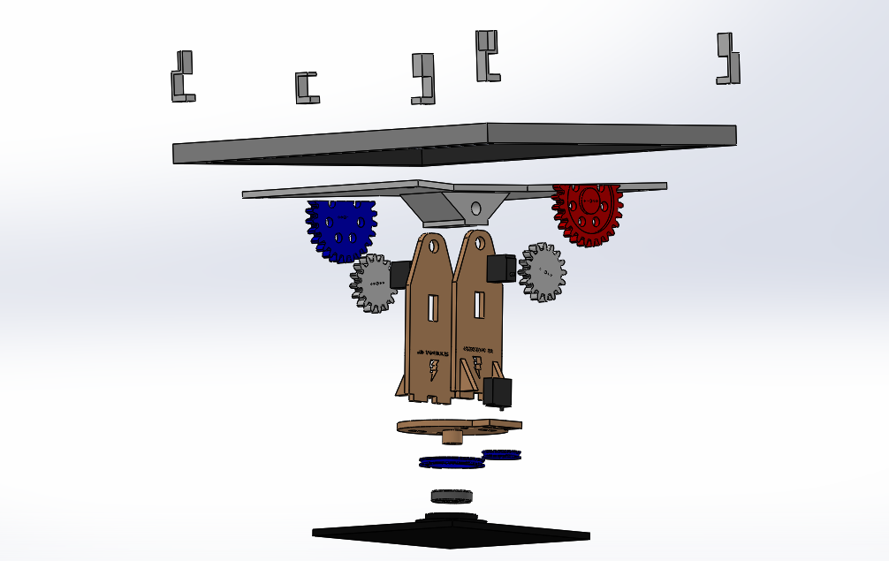
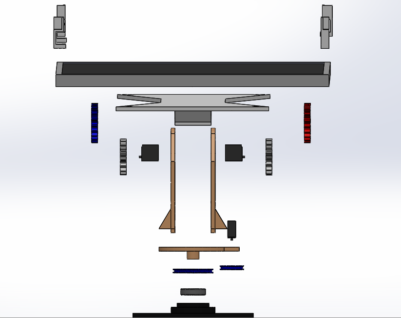

# Solar-Panel
Code for a solar tracking panel with 3 servos (X and Y axis) and light sensors.

## How It Works

This solar panel uses 4 photo sensors to detect the sun´s position and move the solar panel to face it. It uses MG968 Servos to carry and move the weight of a 3kg Solar Panel in the X and Y axis. It uses and Arduino Nano for servo and sensor processing which can connect real time with a computer to visualize data (wired connection).

## Build 

All the project, including base, gears and pulleys where costumed designed and either 3D printed or hand made.
The project uses a polycrystal 50 watt, 18 volts solar panel with a weight of 3kg.

## Future Advancements

- Get a wireless connection using and ESP8266.
- Change Servo motors to step motors (more torque).
- Get the efficiency between a 1 axis solar panel and a 2 axis one.
- Make a larger power bank

# Pictures

## Solidworks

